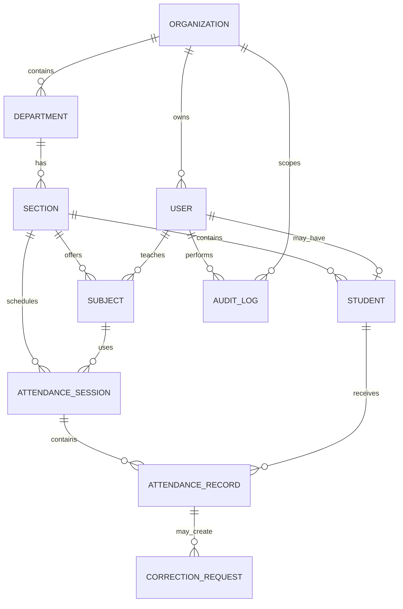

# AttendX Data Model

## Important indexes

- `Organization.slug` — unique
- `User.email` — unique
- `Department(organizationId, code)` — unique
- `Section(organizationId, departmentId, name, academicYear)` — unique
- `Subject(organizationId, code, sectionId)` — unique
- `Student(organizationId, rollNumber)` — unique
- `AttendanceSession(organizationId, sectionId, subjectId, date, startTime)` — unique
- `AttendanceRecord(sessionId, studentId)` — unique

## Tenant ownership

`organizationId` is present on all operational collections. `AuditLog.organizationId` can be null only for platform-level events.
